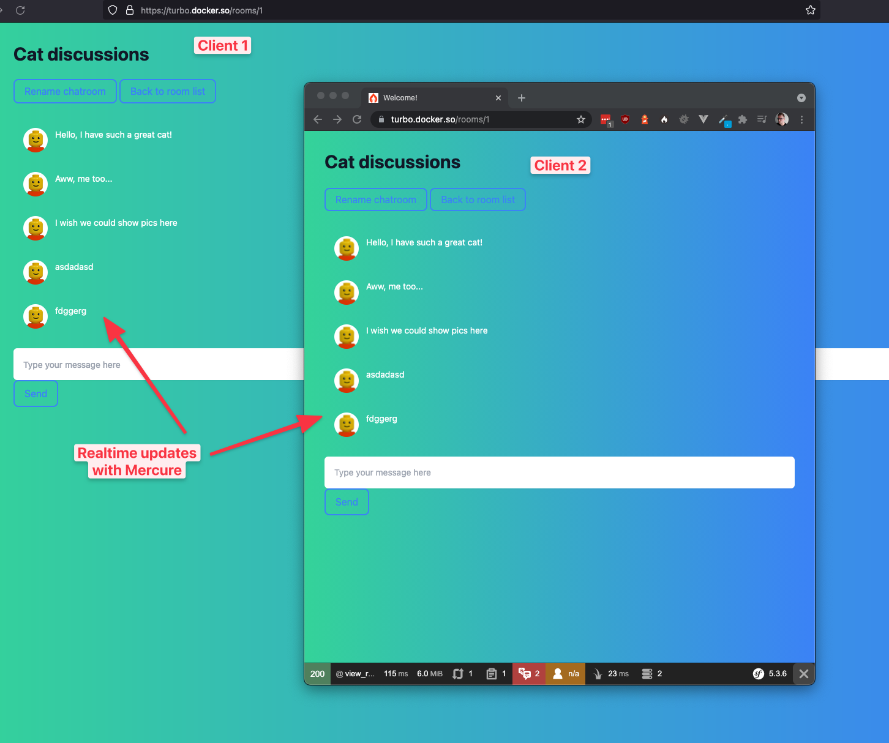

# Symfony UX Turbo Demo Application

Chat application demo on how Symfony UX Turbo can be used to make server-rendered applications more dynamic without
resorting to custom JavaScript code.

Made by mixing these 3 together:

- https://github.com/ocrampete16/symfony-ux-turbo-demo
- https://github.com/dunglas/symfony-docker
- https://github.com/druidfi/stonehenge



## Requirements

- Docker
- [Stonehenge](https://github.com/druidfi/stonehenge)
- PHP 8.0
- Node + Yarn

## Setup

Build and start all things:

```
make fresh
```

## Watch

Start watching changes in CSS and JS:

```
make watch
```

Ready! Now go to https://turbo.docker.so/ to see your site.

## Notes

Turbo Frames are given red borders while Turbo Streams are given blue borders to better identify them.
